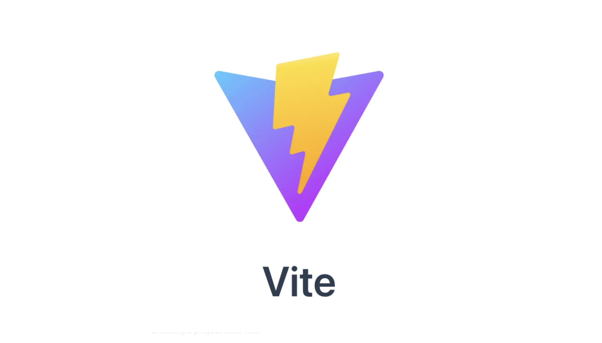
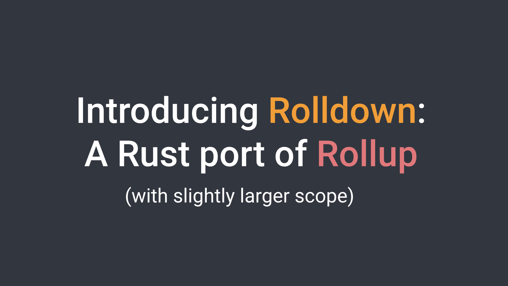
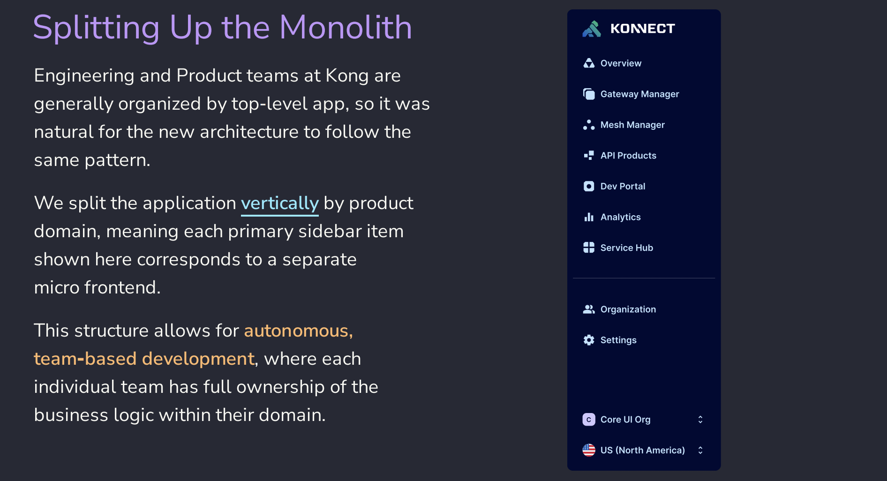
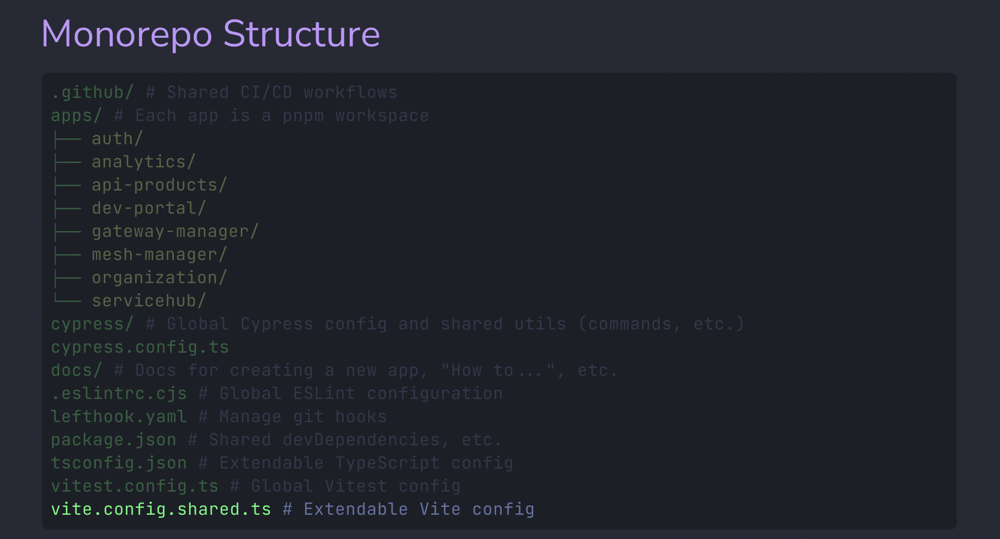
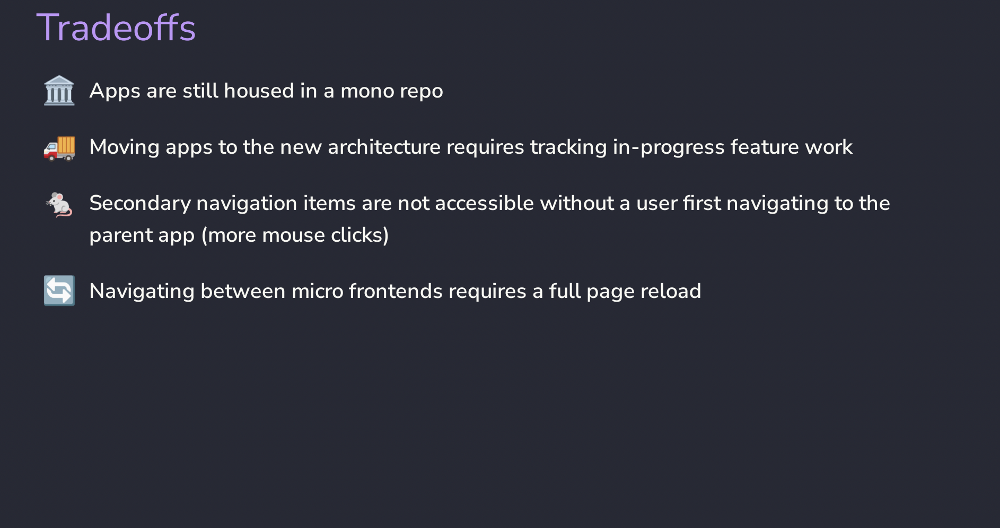
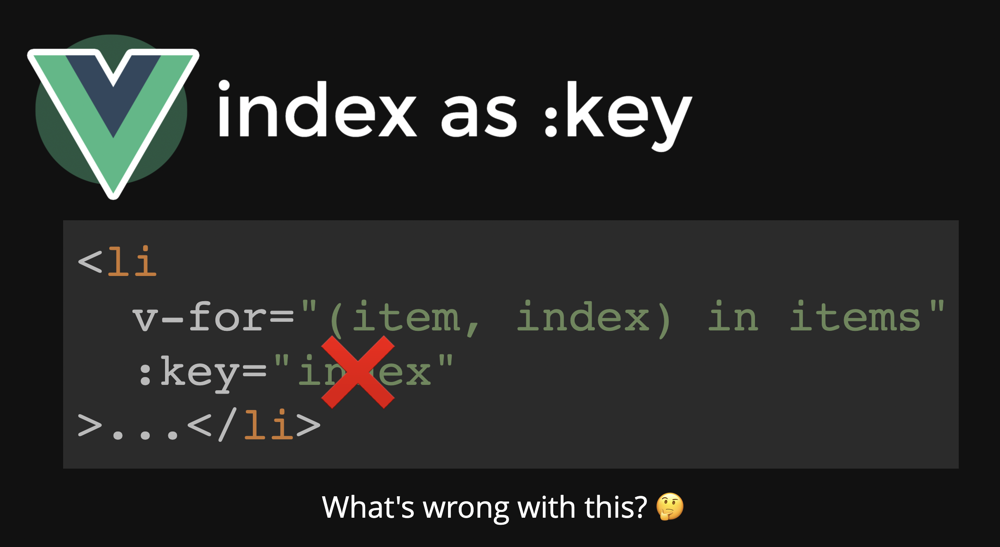
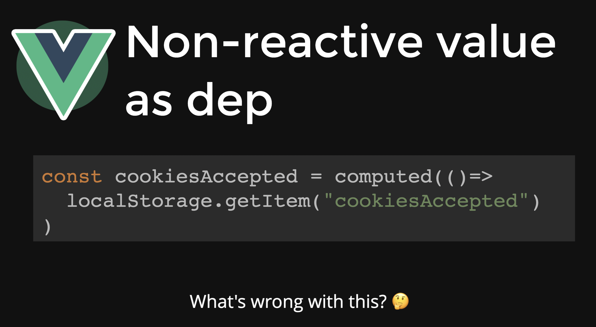
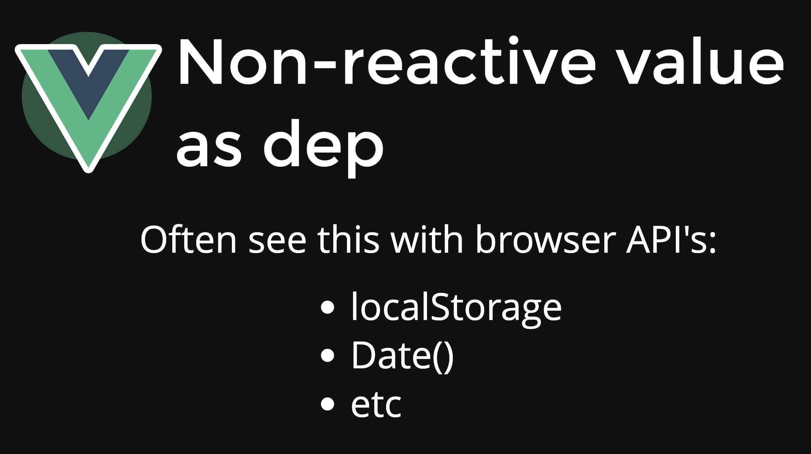
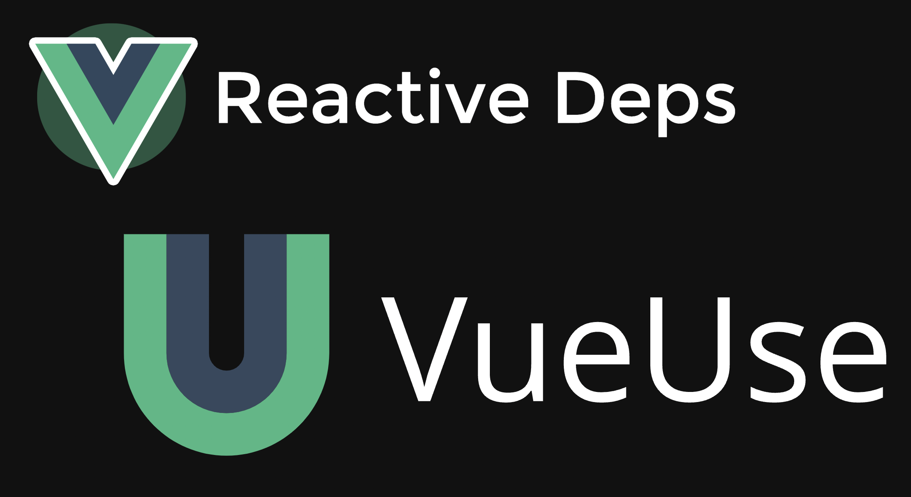
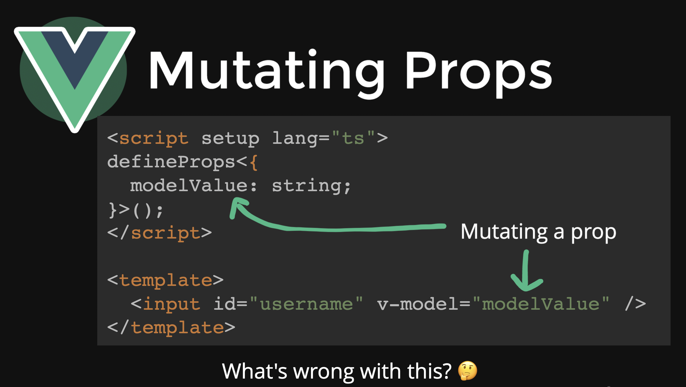

# VueConf Toronto 2023 Highlights

---
layout: section
---

# Day 1: Advanced Patterns for Simplifying Components Workshop

---
layout: default
---

---
layout: default
---

---
layout: default
---

---
layout: default
---

---
layout: default
---

---
layout: default
---

---
layout: default
---

---
layout: default
---

---
layout: section
---

# Day 2: The Main Event

---
layout: big-points
title: Top Talks
titleRow: true
---

# Top Talks

- Evan You: Vite & Vue Updates
- Eduardo San Martin Morote: Pinia DisasterClass
- Adam DeHaven: Scalable Architectures with Vue Micro Frontends: A Developer-Centric Approach
- Daniel Kelly: Common Mistakes in Vue.js and How to Avoid Them

---
layout: section
---

# Vite & Vue Updates from Evan You

---
layout: quote
author: Evan You (2023)
---

# We made some mistakes...

---
layout: default
---

---
layout: default
---

---
layout: default
---

---
layout: default
---

---
layout: default
---

---
layout: default
---

---
layout: default
---

---
layout: default
---

---
layout: default
---

---
layout: default
---

---
layout: section
---

# Pinia DisasterClass

---
layout: quote
author: Eduardo San Martin Morote (2023)
---

# We often see Pinia or stores as the place to store global state but I think that's not only limiting what a store can do but also can lead us down the wrong path.

---
layout: default
---

---
layout: default
---

---
layout: default
---

---
layout: default
---

---
layout: section
---

# Scalable Architectures with Vue Micro Frontends: A Developer-Centric Approach

---
layout: default
---

---
layout: default
---

---
layout: default
---

---
layout: default
---

---
layout: default
---

---
layout: section
---

# Common Mistakes in Vue.js and How to Avoid Them

---
layout: default
---

---
layout: default
---

---
layout: default
---

---
layout: default
---

---
layout: default
---

---
layout: default
---

---
layout: default
---

# Vapor Mode

## Current Implementation

- Uses a VDOM, creating a VNode for each dom element
- When a component updates, it goes through its VNodes and updates the dom elements

## Vapor Implementation

- Group static markup into one VNode
- Patch Flags: Re-render updated areas of component instead of whole component

## When?

- Doesn't support everything yet (transitions, teleport)
- Experimental feature coming in Vue 3.6

https://vapor-repl.netlify.app/

---
layout: image-left
image: images/vitejs-logo.svg.png
backgroundSize: 50%
---

# Vite Update

- Currently Vite uses different bundlers for dev and prod
  - ESBuild - used it local dev, uses ESM, fast to update
  - Rollup - used to build for prod, great plugin support

- Still hard at work to build Rolldown, which will combine ESBuild and Rolldown
- https://vite.dev/

---
layout: image-right
image: images/round-bubbles.png
backgroundSize: 50%
---

# Oxc

- Found limitations in other libraries while working on Rolldown, so ...
- Working on Oxc! Combined parser, linter, formatter, transformer, minifier, resolver, all written in Rust.
- Founded Void(0), 4.6M in funding
- Building complete unified toolchain
- https://oxc.rs/

---
layout: image-left
image: images/vueuse.svg
backgroundSize: 50%
---

# Talk on Performance

- All examples using https://vueuse.org/
- [useVirtualList](https://vueuse.org/core/useVirtualList/#usevirtuallist)
- [useElementVisibility](https://vueuse.org/core/useElementVisibility/#useelementvisibility)
- [useWebWorkerFn](https://vueuse.org/core/useWebWorkerFn/#usewebworkerfn)

---
layout: image-right
image: images/pinia-colada.svg
---

# Talk on Data Loaders

- Plugin for Vue Router https://uvr.esm.is/data-loaders/
- Control loading data through navigation instead of components
- Can you use basic loaders or use pinia colada queries
- Feels like an integration of Vue Router and Pinia Colada
- May be adopted into Vue Router if approve

---
layout: image-left
image: images/zod.svg
backgroundSize: 75%
---

# Contract Testing

- Today, we have mocks in our unit tests for api calls
- When api calls change, we should be updating our mock data.  If we don't, our tests could be missing things.
- Talk was an ad for Schematic product to help with this problem
- Could still do the same thing with zod, zod-openapi and zod-mock

---
layout: section
---

# Honorable Mentions

---
layout: big-points
title: Top Talks
titleRow: true
---

# Honorable Mentions

- Sebastien Chopin: Vue to the Edge
- Justin Schroeder: Conquering forms in Vue
- Alexander Lichter: The Vue-niverse of SEO: Uncovering the Secret
- Maria Lamardo: Prevent, Catch and Fix Accessibility Issues

---
layout: outro
title: Outro
repository: 'https://github.com/zackshavedh/vueconf-2023-highlights'
---

  
Thank you for listening!

  <!-- 
Questions?
 -->

