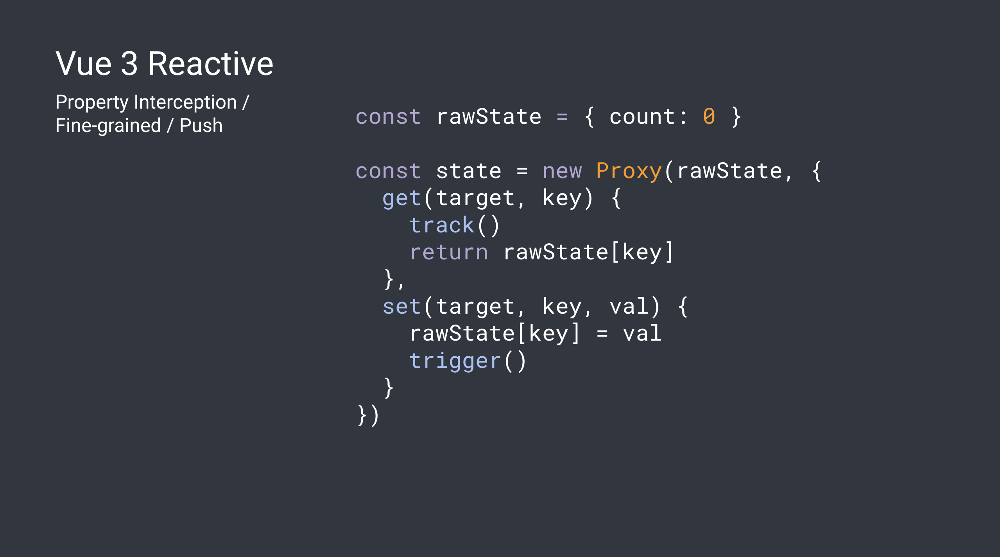
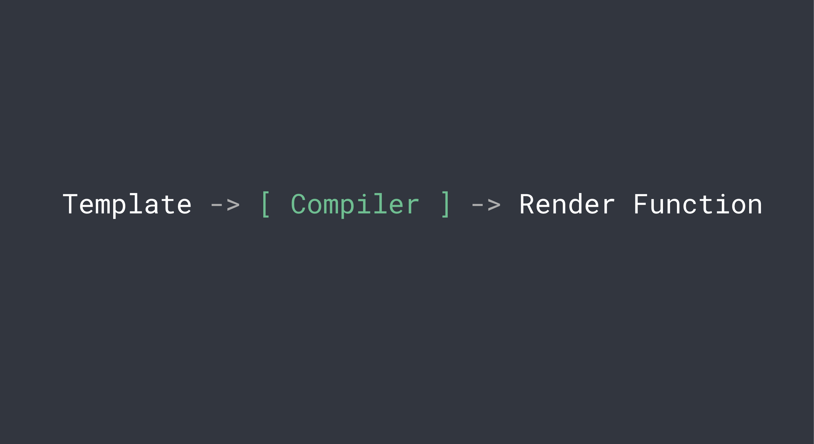
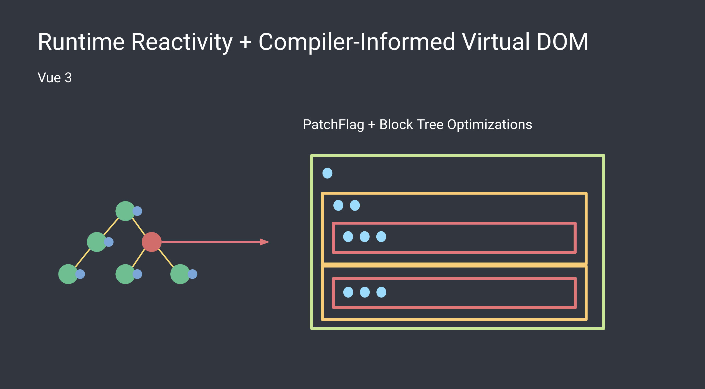

# VueConf Toronto 2024 Highlights

---
layout: section
---

# Understanding Vue From The Bottom Up Workshop

---
layout: image-right
image: theme/assets/slides/key-concepts.png
backgroundSize: 75%
---

<div class="pt-35">
<h1>Key Concepts</h1>

- Reactivity
- Compiling
- Rendering

</div>

---
layout: image-right
image: theme/assets/slides/reactivity.png
backgroundSize: 75%
---

<div class="pt-25">
<h1>Reactivity</h1>

- UI components automatically update when data changes
- Core primitives: Dependencies & Effects
  - Dependencies are data that is tracked
  - Effects execute code when dependencies change

</div>

---
layout: image-right
image: theme/assets/slides/ref.png
backgroundSize: 100%
---

<div class="pt-40">

- In JavaScript, we can intercept property read/write via getter/setters
- We track active effects on `get`
- We trigger updates on `set`

</div>

---
layout: default
---



---
layout: image-right
image: theme/assets/slides/compiler.png
backgroundSize: 75%
---

<div class="pt-15">

<h1>Compiler</h1>

- Abstract Syntax Tree (AST)
  - Created during template parsing
  - A tree representation of source code syntax
  - Represents template structure and expressions
- Intermediate Representation (IR)
  - Step between AST and final compiled code
  - Used by the compiler to apply optimizations
  - Output is passed to render function
  
</div>

---
layout: default
---



---
layout: image-right
image: theme/assets/slides/runtime.png
backgroundSize: 75%
---

<div class="pt-5">

<h1>Rendering</h1>

- Vue uses a "Compiler Informed" virtual DOM  
- PatchFlag & Block Tree Optimizations

```js
// Template
<div>
  <h1>Static</h1>
  <div>{{ dynamic }}</div>
</div>

// Compiles to something like
createBlock("div", null, [
  // Static content - not tracked for updates
  createVNode("h1", null, "Static"),
  // Dynamic content - tracked in dynamicChildren
  createVNode("div", null, dynamic, PatchFlags.TEXT)
])
```

</div>

---
layout: default
---



---
layout: section
---

# Conference Talks


---
layout: default
---

# Vapor Mode

## Current Implementation

- Uses a VDOM, creating a VNode for each dom element
- When a component updates, it goes through its VNodes and updates the dom elements

## Vapor Implementation

- Group static markup into one VNode
- Patch Flags: Re-render updated areas of component instead of whole component

## When?

- Doesn't support everything yet (transitions, teleport)
- Experimental feature coming in Vue 3.6

https://vapor-repl.netlify.app/

---
layout: image-left
image: images/vitejs-logo.svg.png
backgroundSize: 50%
---

# Vite Update

- Currently Vite uses different bundlers for dev and prod
  - ESBuild - used it local dev, uses ESM, fast to update
  - Rollup - used to build for prod, great plugin support

- Still hard at work to build Rolldown, which will combine ESBuild and Rolldown
- https://vite.dev/

---
layout: image-right
image: images/round-bubbles.png
backgroundSize: 50%
---

# Oxc

- Found limitations in other libraries while working on Rolldown, so ...
- Working on Oxc! Combined parser, linter, formatter, transformer, minifier, resolver, all written in Rust.
- Founded Void(0), 4.6M in funding
- Building complete unified toolchain
- https://oxc.rs/

---
layout: image-left
image: images/vueuse.svg
backgroundSize: 50%
---

# Talk on Performance

- All examples using https://vueuse.org/
- [useVirtualList](https://vueuse.org/core/useVirtualList/#usevirtuallist)
- [useElementVisibility](https://vueuse.org/core/useElementVisibility/#useelementvisibility)
- [useWebWorkerFn](https://vueuse.org/core/useWebWorkerFn/#usewebworkerfn)

---
layout: image-right
image: images/pinia-colada.svg
---

# Talk on Data Loaders

- Plugin for Vue Router https://uvr.esm.is/data-loaders/
- Control loading data through navigation instead of components
- Can you use basic loaders or use pinia colada queries
- Feels like an integration of Vue Router and Pinia Colada
- May be adopted into Vue Router if approve

---
layout: image-left
image: images/zod.svg
backgroundSize: 75%
---

# Contract Testing

- Today, we have mocks in our unit tests for api calls
- When api calls change, we should be updating our mock data.  If we don't, our tests could be missing things.
- Talk was an ad for Schematic product to help with this problem
- Could still do the same thing with zod, zod-openapi and zod-mock

---
layout: outro
title: Outro
repository: 'https://github.com/zackshavedh/vueconf-2023-highlights'
---

<div class="absolute left-12 top-[200px] right-12 text-center text-light-600">
  <p class="text-4xl !leading-[1.5em]">Thank you for listening!</p>
</div>

---
layout: default
---

# Slides

- [Keynote With Evan You](https://docs.google.com/presentation/d/1rL2C-ZwnKrEXLkGAR1vk5YZumMSIAyNn4TE0KeR_M0M/edit)
- Understanding Vue From The Bottom Up Workshop
  - [Slides](https://docs.google.com/presentation/d/1O_8W3uvhiu_AOptRiYj2hxITm-VPwJppWV00Y8lq_IA/edit#slide=id.g207b4d8f370_0_35)
  - [Gist](https://gist.github.com/yyx990803/338adf5cd09444653212ef4f5f798836)
- [Considering Performance, and why we switched to composition](https://docs.google.com/presentation/d/1nkFyK0WwINn1W__uLjV1947iZtCK-aMxFydc17g2Mhg/edit?usp=sharing)
- [Async State Management In Vue Router](https://github.com/posva/talk-data-loaders)
- [Contract Testing in Vue](https://talk-contract-testing-nuxt.netlify.app/1)
- [Can Nuxt Make Great Mobile Apps?](https://lihbr.com/talks/vuetoronto/nuxt-mobile-apps)
