# VueConf Toronto 2023 Highlights

---
layout: section
---

# Day 1: Advanced Patterns for Simplifying Components Workshop

---
layout: default
---

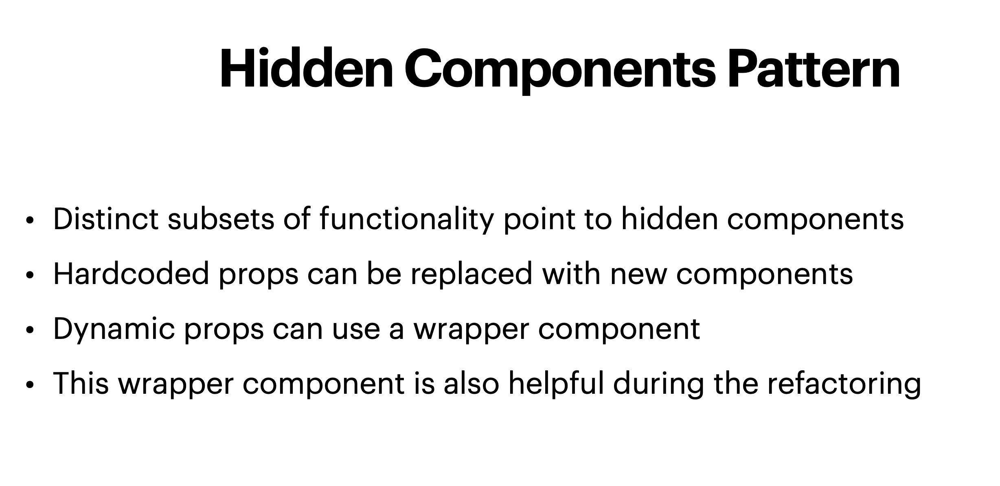

---
layout: default
---

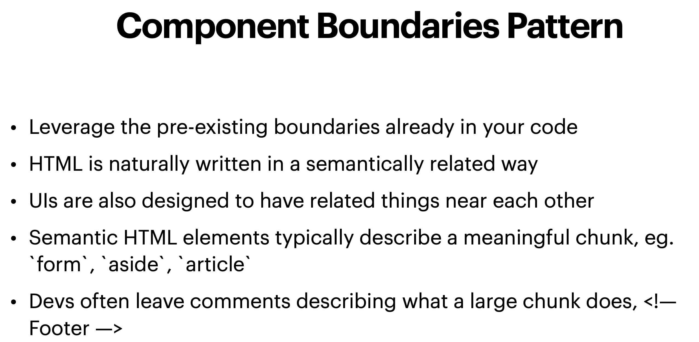

---
layout: default
---

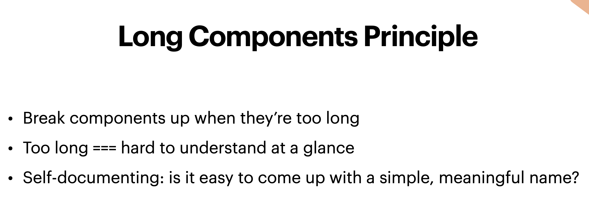

---
layout: default
---

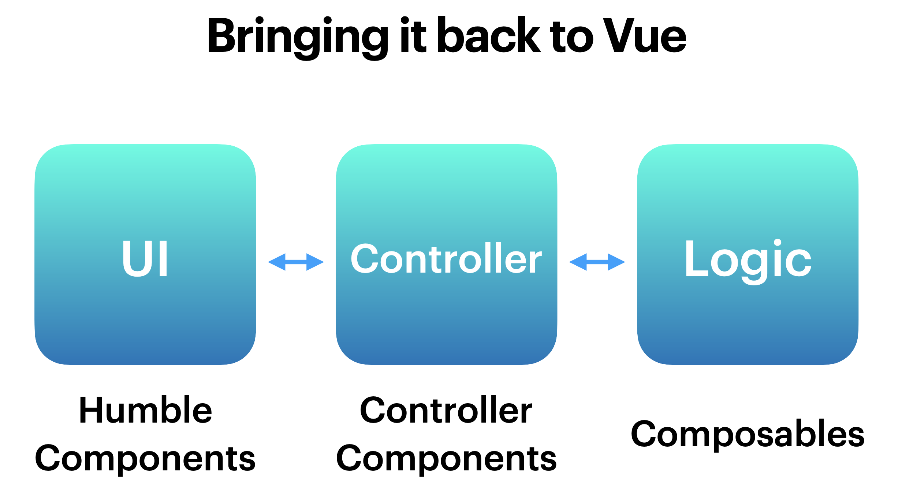

---
layout: default
---

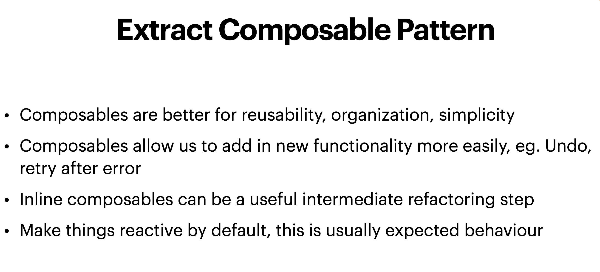

---
layout: default
---

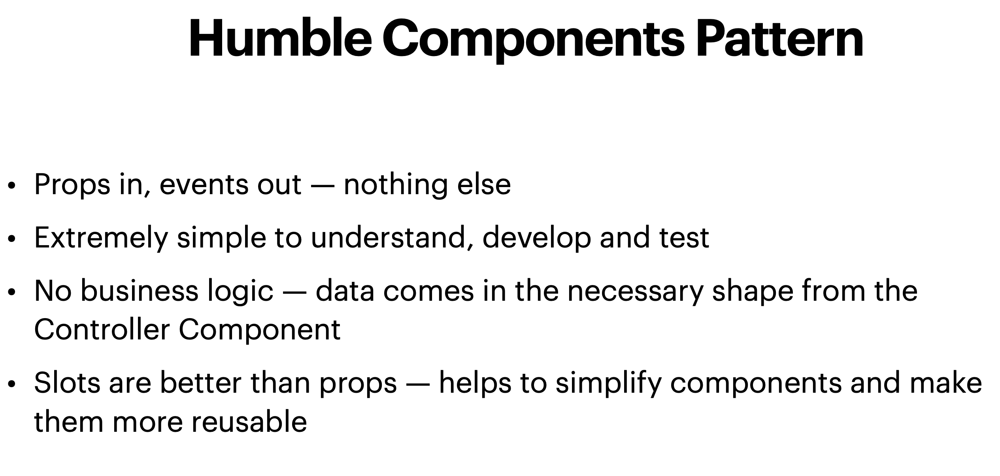

---
layout: default
---

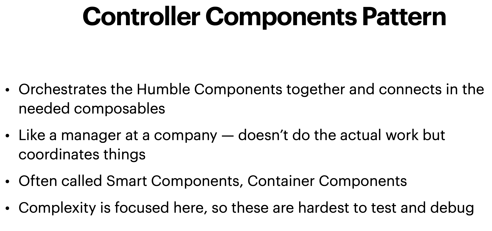

---
layout: default
---

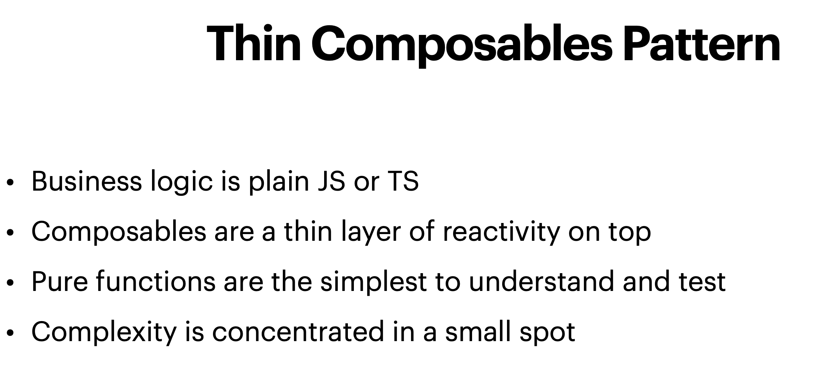

---
layout: section
---

# Day 2: The Main Event

---
layout: big-points
title: Top Talks
titleRow: true
---

- Vite & Vue Updates from Evan You
- Pinia DisasterClass
- Vue To The Edge
- Scalable Architectures with Vue Micro Frontends: A Developer-Centric Approach
- Conquering Forms In Vue
- Common Mistakes in Vue.js and How to Avoid Them

---
layout: quote
author: Evan You (2023)
---

# We made some mistakes...

---
layout: default
---

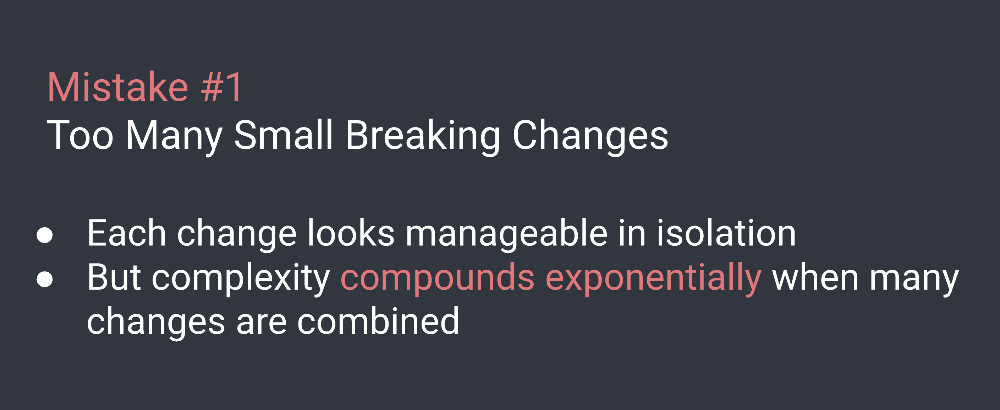

---
layout: default
---

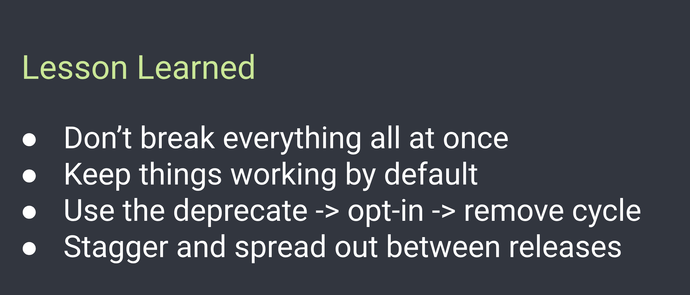

---
layout: default
---

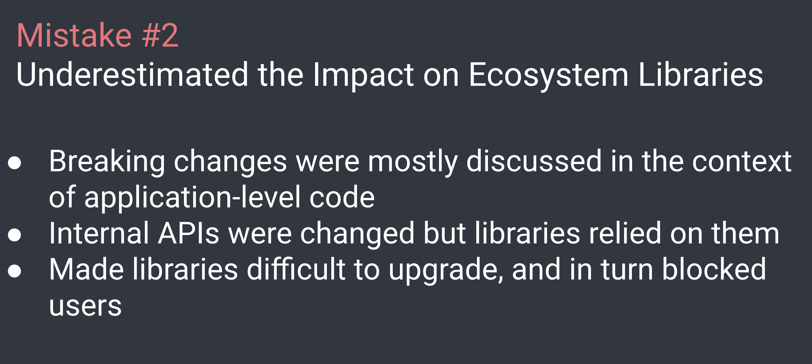

---
layout: default
---

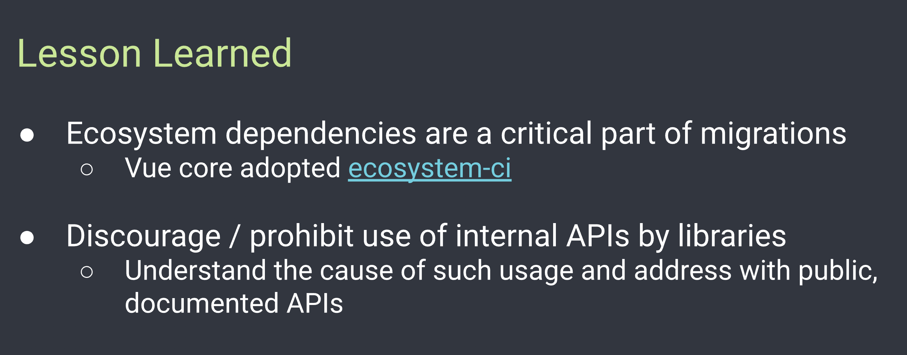

---
layout: default
---

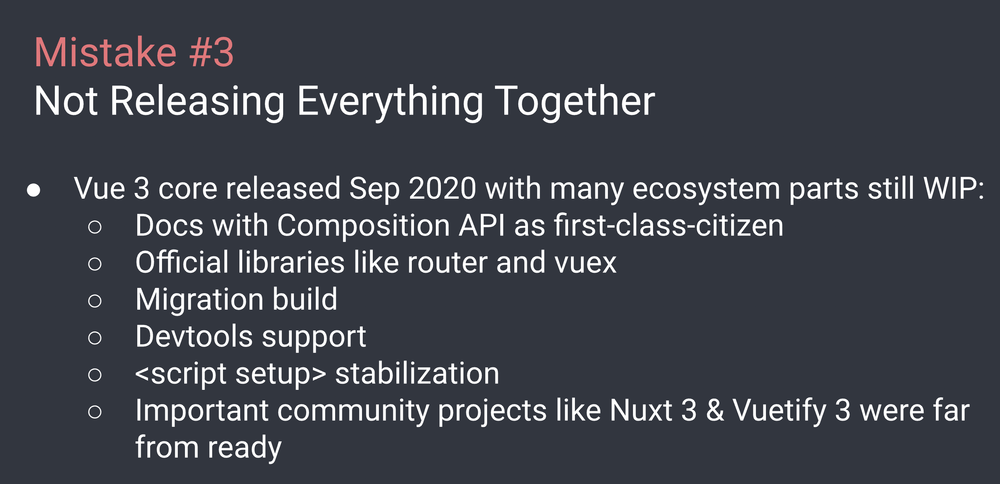

---
layout: default
---

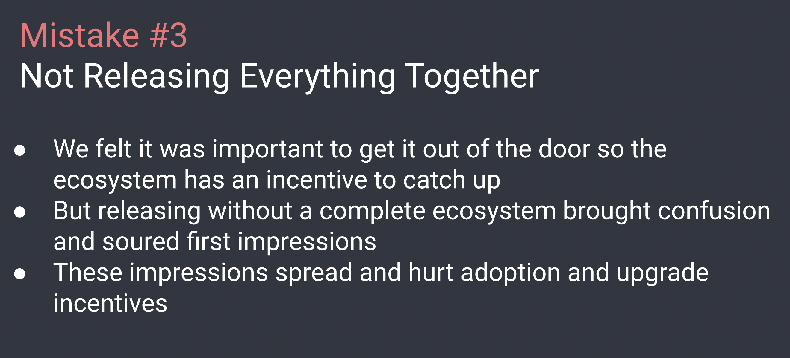

---
layout: default
---

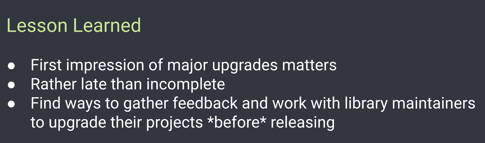

---
layout: default
---

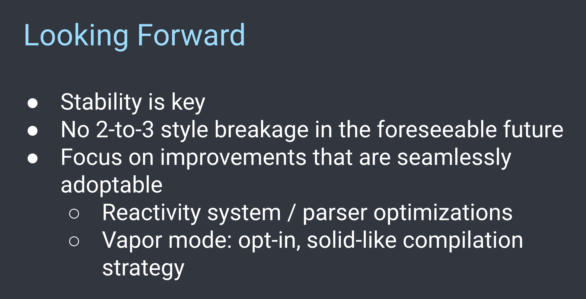

---
layout: quote
author: Eduardo San Martin Morote (2023)
---

# We often see Pinia or stores as the place to store global state but I think that's not only limiting what a store can do but also can lead us down the wrong path.

---
layout: default
---

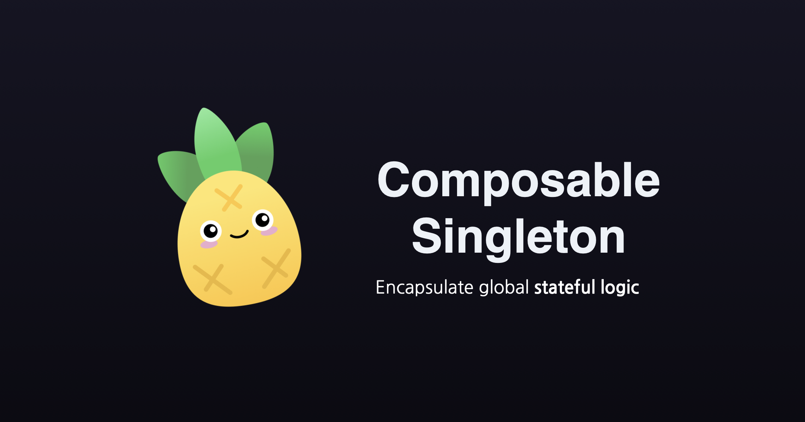

---
layout: default
---

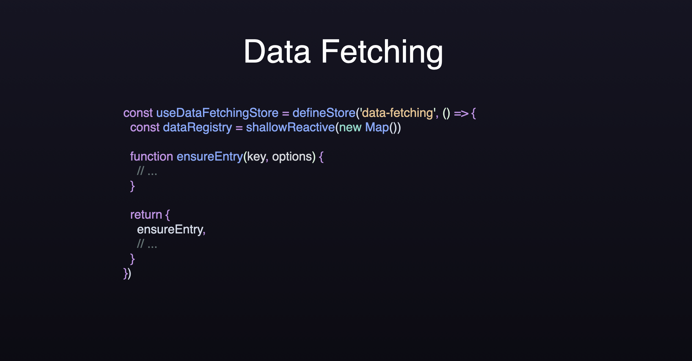

---
layout: default
---

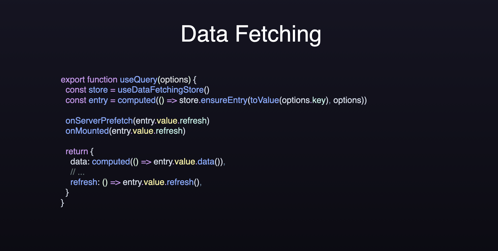

---
layout: default
---

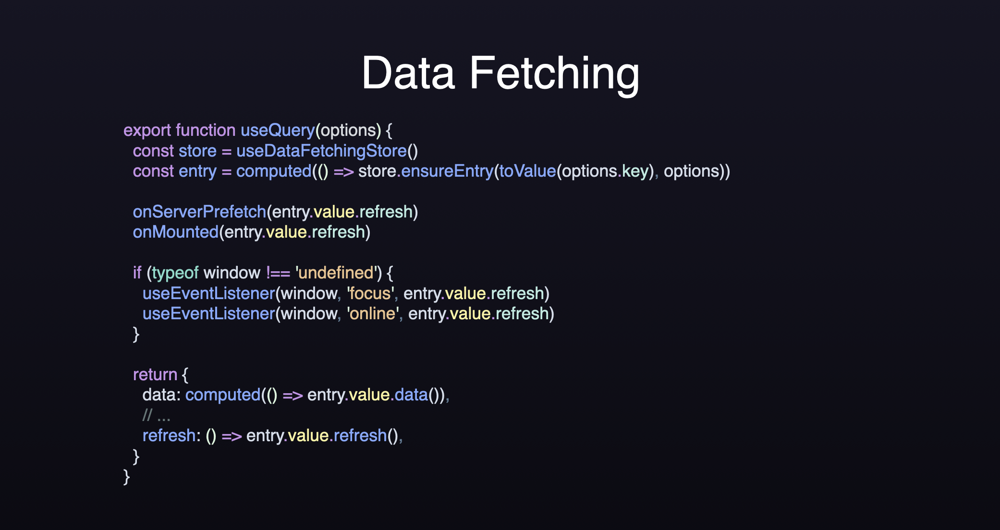

---
layout: video
video: https://player.vimeo.com/video/455611549
---

# You can include Video!

---
layout: outro 
title: Outro
twitter: '@Linus_Borg'
website: 'https://www.linusb.org'
repository: 'github.com/linusborg/slidev-theme-vuetiful'
hostedSlides: 'https://slidev-theme-vuetiful.netlify.app/'
---

  
Thank you for listening!

  <!-- 
Questions?
 -->

